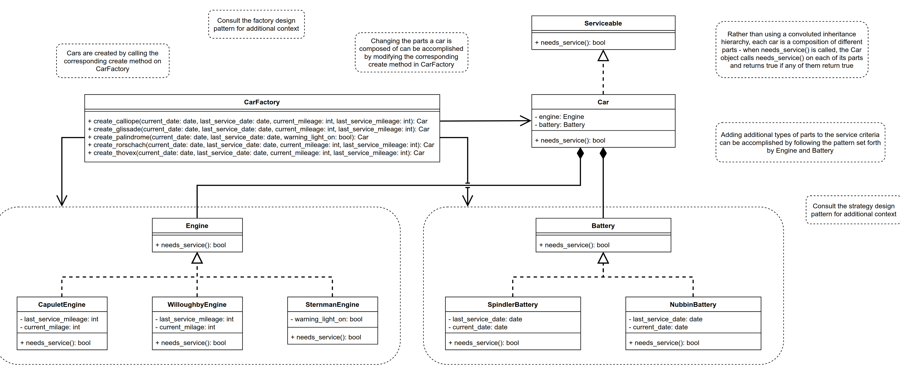

# Component to control car service in lyft
Lyft is in the process of rolling out a new rental fleet in the hopes of encouraging more connected, sustainable cities across the US.

The component itself is responsible for determining whether cars in Lyft’s new rental fleet should be serviced when they are returned.

The problem was solved by a test-driven methodology. First, unit tests were created for each possible case in which each type of car might need service, you can look the unit test for more details.
# Criteria for car servicing

Whether or not a Lyft rental car should be serviced depends on three factors at the moment:

- The engine
- The battery
- The tires

Each of the three types of engines has its own criteria for determining when it should be serviced. The same applies to each type of battery.

The current service criteria are as follows:

| Service criteria | | | | |
|:-------------------:|---|---|---|---|
| Capulet Engine	    |Once every 30,000 miles
| Willoughby Engine	    |Once every 60,000 miles
| Sternman Engine	    |Only when the warning indicator is on
| Spindler Battery      |Once every 2 years
| Nubbin Battery	    | Once every 4 years

There are five car models in Lyft’s fleet, each with a different engine-battery combination. These are outlined below:
| Car     | engine| battery| | |
|:-------------------:|---|---|---|---|
Calliope  |	Capulet Engine    |	Spindler Battery
Glissade  |Willoughby Engine  |	Spindler Battery
Palindrome|	Sternman Engine	  |Spindler Battery
Rorschach |Willoughby Engine  |Nubbin Batte
Thovex	  |Capulet Engine	  |Nubbin Battery

## Tire servicing criteria

    There are two types of tires currently in use by the Lyft fleet Carrigan tires and Octoprime tires.
    
    The new tire wear sensors produce an array of four numbers between 0 and 1 inclusive, representing how worn each of the tires are.
    This array will be passed to each function in the car factory class, to be used by your tire implementation.
    Carrigan tires should be serviced only when one or more of the values in the tire wear array is greater than or equal to 0.9.
    Octoprime tires should be serviced only when the sum of all values in the tire wear array is greater than or equal to 3.

# Architecture

# Autors
Jesus Manuel Macias Martinez (Backend Developer)